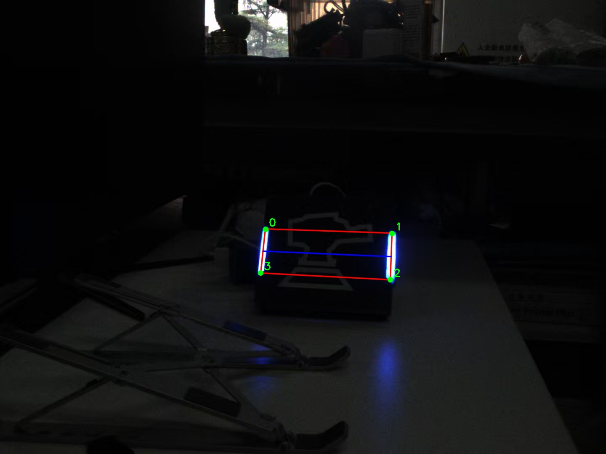

# RM 装甲板识别

RoboMaster 自瞄任务基础：从单张图片中提取敌方装甲板灯条，并计算装甲板的四个角点像素坐标。

参考 [rm_vision/rm_auto_aim](https://gitlab.com/rm_vision/rm_auto_aim/-/tree/main/armor_detector) 的实现思路，保持代码和参数尽量简单。



## 项目结构

```text
.
├── CMakeLists.txt
├── README.md
├── include/
│   └── ArmorDetector.hpp    # 检测器头文件
├── src/
│   ├── ArmorDetector.cpp    # 核心检测算法
│   └── main.cpp             # 示例程序
└── data/                    # 运行时生成，不提交（.gitignore 已忽略）
    ├── demo_input.jpg
    └── demo_result.jpg
```

## 依赖

- C++17
- OpenCV 4.x
- CMake >= 3.16

Ubuntu 安装示例：

```bash
sudo apt update
sudo apt install build-essential cmake libopencv-dev
```

## 编译

```bash
cd rm-lecture3-detection
mkdir build && cd build
cmake ..
make -j$(nproc)
```

## 运行

```bash
# 使用自己的图片
./rm_armor_detector ../test.png

# 使用内置 demo
./rm_armor_detector --demo
```

结果图会保存在 `build/result.jpg`（或 `build/data/demo_result.jpg`）。

## 算法流程

1. **预处理**
   - 转灰度图，用固定阈值 `binary_thres` 直接二值化。
   - 灯条在画面中是高亮区域，灰度二值化即可把它从黑暗背景中分离出来。

2. **灯条提取**
   - `findContours` 找外轮廓。
   - 对每个轮廓用 `minAreaRect` 得到旋转矩形。
   - 把旋转矩形的四个角点按 `y` 排序，取上面两点中点作为 `top`，下面两点中点作为 `bottom`。
   - 过滤：
     - 短边 / 长边在 `[min_ratio, max_ratio]` 之间
     - `top-bottom` 与竖直方向夹角小于 `max_angle`
   - 在轮廓区域内比较 `B` 通道和 `R` 通道平均值，判断灯条颜色。

3. **灯条配对**
   - 只配对同颜色灯条。
   - 排除两根灯条中间还夹着其他灯条的情况。
   - 检查：
     - 两根灯条长度接近
     - 中心距离 / 平均灯条长度在 `[min_center_distance, max_center_distance]` 之间
     - 中心连线与水平方向夹角小于 `max_angle`

4. **角点计算**
   - 左灯条 `top` 作为左上角 `tl`
   - 右灯条 `top` 作为右上角 `tr`
   - 右灯条 `bottom` 作为右下角 `br`
   - 左灯条 `bottom` 作为左下角 `bl`
   - 这样 0-3 边、1-2 边天然与灯条边缘平行。

## 可调参数

参数集中在 `ArmorParam` 中：

| 参数 | 含义 | 默认值 |
|---|---|---|
| `binary_thres` | 灰度二值化阈值 | 180 |
| `color` | 目标颜色 | `BLUE` |
| `light.min_ratio` | 灯条短边/长边下限 | 0.1 |
| `light.max_ratio` | 灯条短边/长边上限 | 0.6 |
| `light.max_angle` | 灯条最大倾斜角 | 35° |
| `armor.min_light_ratio` | 配对灯条长度之比下限 | 0.7 |
| `armor.min_center_distance` | 中心距离 / 平均长度 下限 | 1.5 |
| `armor.max_center_distance` | 中心距离 / 平均长度 上限 | 5.0 |
| `armor.max_angle` | 装甲板中心连线最大倾斜角 | 30° |

如果换了一张图识别效果不好，优先调 `binary_thres`，其次是 `light.max_ratio` 和 `armor.max_center_distance`。

## 参考

- [rm_vision/rm_auto_aim](https://gitlab.com/rm_vision/rm_auto_aim/-/tree/main/armor_detector)
- [ailuree/Board_detect_RM](https://github.com/ailuree/Board_detect_RM)

## License

仅供学习交流使用。
